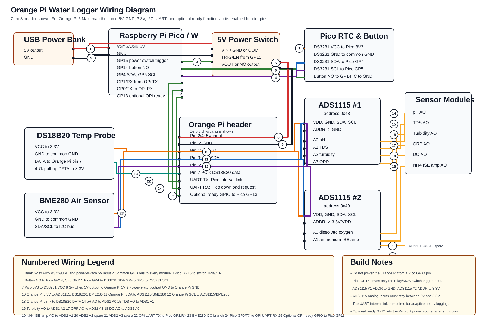

# Orange Pi Water Logger

This starter project logs water-condition readings to a CSV file on the Orange Pi microSD card every 6 hours.

## Sensors included

- pH
- TDS
- Turbidity
- DS18B20 temperature
- ORP
- Dissolved oxygen
- Ammonium ISE
- BME280 ambient temperature, humidity, and pressure

## Calculated values

- EC from TDS
- Estimated salinity
- Water clarity percent
- Dissolved oxygen saturation percent
- Toxic ammonia NH3 estimate from ammonium, pH, and temperature
- Ammonia risk label
- Overall water score and condition label
- Ambient dew point
- Air/water temperature difference
- Adaptive next logging interval from barometric pressure

## Materials

Core computer and power:

| Qty | Item | Notes |
| ---: | --- | --- |
| 1 | Orange Pi Zero 3 | Main logger, stores CSV on microSD |
| 1 | microSD card | 16GB or larger recommended |
| 1 | Raspberry Pi Pico or Pico W | Low-power timer and download-mode button controller |
| 1 | USB power bank | 10,000mAh minimum; larger is better |
| 1 | 5V load switch module | Rated at least 3A, preferably 5A |
| 1 | DS3231 RTC module | Keeps accurate time for the Pico controller |
| 1 | Momentary push button | Download-mode button |
| 1 | Weatherproof enclosure | Large enough for Orange Pi, Pico, ADCs, and wiring |

Sensor and interface modules:

| Qty | Item | Notes |
| ---: | --- | --- |
| 2 | ADS1115 ADC modules | I2C analog inputs for Orange Pi |
| 1 | pH sensor board and BNC pH probe | Analog output to ADS1115 |
| 1 | TDS sensor meter V1.0 board and probe | Analog output to ADS1115 |
| 1 | Turbidity sensor module and probe | Analog output to ADS1115 |
| 1 | Waterproof DS18B20 temperature probe | Digital 1-Wire temperature |
| 1 | ORP sensor module and BNC ORP probe | Analog output to ADS1115 |
| 1 | Gravity analog dissolved oxygen sensor kit | Analog output to ADS1115 |
| 1 | NH4+ ammonium ISE probe | BNC probe |
| 1 | High-impedance ISE interface amplifier | Required between NH4+ probe and ADS1115 |
| 1 | BME280 I2C sensor module | Ambient air temperature, humidity, and barometric pressure |

Wiring and protection:

| Qty | Item | Notes |
| ---: | --- | --- |
| 1 | 4.7k resistor | DS18B20 data pull-up to 3.3V |
| Assorted | Jumper wires or hookup wire | Use reliable connectors for field use |
| Assorted | Screw terminals or waterproof connectors | Makes sensor replacement easier |
| Assorted | Heat shrink tubing | Strain relief and insulation |
| Assorted | Cable glands | For waterproof enclosure cable exits |
| As needed | Voltage divider resistors or level shifters | Required if sensor analog output can exceed 3.3V |
| 2 | UART link wires between Orange Pi and Pico | Required for download button requests and adaptive wake timing |
| Optional | Small fuse or resettable polyfuse | Protection on 5V power line |
| Optional | Desiccant pack | Helps reduce moisture in enclosure |

Calibration and maintenance:

| Qty | Item | Notes |
| ---: | --- | --- |
| 1 set | pH buffer solutions | pH 4.00, 7.00, and 10.00 |
| 1 | TDS calibration solution | Common examples: 342ppm or 1000ppm |
| 1 | ORP calibration solution | Match your ORP probe/module instructions |
| 1 | Dissolved oxygen calibration supplies | Follow Gravity DO kit instructions |
| 1 set | NH4+ ISE calibration standards | At least two known concentrations |
| 1 | Distilled or deionized water | Rinsing probes between calibration steps |
| Optional | Cleaning/storage solutions | Especially for pH, ORP, DO, and ISE probes |

## Hardware shape

Use two ADS1115 ADC boards on the Orange Pi Zero 3 I2C header.

## Wiring diagram



The supplied visual diagram is mostly accurate, with these corrections:

- The 5V load switch `IN+` must connect to the USB power bank 5V, not to a Pico GPIO pin.
- The 5V load switch `IN-`/GND must connect to the common ground bus.
- Pico `GP15` must connect to the load switch `EN` pin only.
- Pico `GP14` must connect to the download button only, not to the load switch.
- ADS1115 #1 must have `ADDR -> GND` for address `0x48`.
- ADS1115 #2 must have `ADDR -> 3.3V` for address `0x49`.
- Any sensor analog output above 3.3V needs level scaling before the ADS1115 input.

In the numbered image, the ADC, DS18B20, I2C, RTC, and button sections are broadly right. Recheck the load-switch section carefully before building.

Corrected numbered wiring:

| Number | Correct connection |
| --- | --- |
| 1 | Power bank 5V to Pico USB/VSYS and load switch `IN+` |
| 2 | Common GND bus to Pico GND, load switch `IN-`, Orange Pi GND, ADC GND, sensor GND |
| 3 | Pico `GP15` to load switch `EN` |
| 4 | Pico `GP14` to one side of download button |
| 5 | Pico `GP4` to DS3231 SDA |
| 6 | Pico `GP5` to DS3231 SCL |
| 7 | Pico `3V3` to DS3231 VCC |
| 8 | Load switch `OUT+` to Orange Pi 5V input, pin 2 or 4 |
| 9 | Load switch `OUT-` to Orange Pi GND, pin 6 |
| 10 | Orange Pi pin 1 `3.3V` to ADS1115 VDD and DS18B20 VCC |
| 11 | Orange Pi pin 3 SDA to both ADS1115 SDA pins |
| 12 | Orange Pi pin 5 SCL to both ADS1115 SCL pins |
| 13 | Orange Pi pin 7 PC9/GPIO7 to DS18B20 data, with 4.7k pull-up to 3.3V |
| 14 | ADS1115 #1 A0 to pH analog output |
| 15 | ADS1115 #1 A1 to TDS analog output |
| 16 | ADS1115 #1 A2 to turbidity analog output |
| 17 | ADS1115 #1 A3 to ORP analog output |
| 18 | ADS1115 #2 A0 to dissolved oxygen analog output |
| 19 | ADS1115 #2 A1 to ammonium ISE amplifier analog output |
| 20 | ADS1115 #2 A2 spare |
| 21 | ADS1115 #2 A3 spare |

Corrected wiring view:

```text
                                  USB POWER BANK
                                5V OUT      GND
                                  |          |
                                  |          +-------------------- COMMON GND BUS
                                  |                               |
                                  v                               |
                    +-----------------------------+               |
                    | Raspberry Pi Pico / Pico W  |               |
                    |                             |               |
                    | VSYS/USB <- 5V power bank   |               |
                    | GND ------ COMMON GND BUS --+               |
                    | GP15 ---- power enable ----------------+    |
                    | GP14 ---- download button ---- GND     |    |
                    | GP4  ---- DS3231 SDA                   |    |
                    | GP5  ---- DS3231 SCL                   |    |
                    | 3V3  ---- DS3231 VCC                   |    |
                    +-----------------------------+           |    |
                                                              |    |
                                  +---------------------------+    |
                                  v                                |
                         +------------------+                      |
                         | 5V LOAD SWITCH   |                      |
                         | EN  <- Pico GP15 |                      |
                         | IN+ <- bank 5V   |                      |
                         | IN- <- GND bus --+----------------------+
                         | OUT+ -> OPi 5V   |
                         | OUT- -> OPi GND  |
                         +------------------+
                                  |
                                  v
                    +-----------------------------+
                    | Orange Pi Zero 3            |
                    | Pin 2/4 5V <- switched 5V   |
                    | Pin 6 GND  -> common GND    |
                    | Pin 1 3.3V -> 3.3V rail     |
                    | Pin 3 SDA  -> I2C SDA rail  |
                    | Pin 5 SCL  -> I2C SCL rail  |
                    | Pin 7 PC9  -> DS18B20 DATA  |
                    +-----------------------------+
                         |        |        |
                         |        |        +---------------- I2C SCL rail
                         |        +------------------------- I2C SDA rail
                         +---------------------------------- 3.3V rail

      3.3V rail ----------------+----------------------+----------------------+
                                |                      |                      |
                                v                      v                      v
                    +-------------------+  +----------------------+  +----------------------+
                    | ADS1115 #1        |  | ADS1115 #2           |  | DS18B20 temp probe   |
                    | ADDR -> GND       |  | ADDR -> 3.3V/VDD     |  | Red/VCC -> 3.3V      |
                    | address 0x48      |  | address 0x49         |  | Black/GND -> GND     |
                    | VDD -> 3.3V       |  | VDD -> 3.3V          |  | Yellow/DATA -> OPi 7 |
      GND bus ---->| GND -> GND        |  | GND -> GND           |  | 4.7k DATA -> 3.3V    |
      SDA rail --->| SDA -> OPi pin 3   |  | SDA -> OPi pin 3     |  +----------------------+
      SCL rail --->| SCL -> OPi pin 5   |  | SCL -> OPi pin 5     |
                    | A0 <- pH AO        |  | A0 <- DO AO          |
                    | A1 <- TDS AO       |  | A1 <- NH4 ISE AO     |
                    | A2 <- turbidity AO |  | A2 spare             |
                    | A3 <- ORP AO       |  | A3 spare             |
                    +-------------------+  +----------------------+
                              ^     ^     ^     ^            ^          ^
                              |     |     |     |            |          |
                              |     |     |     |            |          |
       +----------------------+     |     |     |            |          |
       |                            |     |     |            |          |
+-------------+              +-------------+ +-------------+ +-------------+ +------------------+
| pH module   |              | TDS module  | | Turbidity   | | ORP module  | | Gravity DO       |
| VCC -> 5V*  |              | VCC -> 5V*  | | VCC -> 5V*  | | VCC -> 5V*  | | VCC -> 3.3-5V*   |
| GND -> GND  |              | GND -> GND  | | GND -> GND  | | GND -> GND  | | GND -> GND       |
| AO -> A0    |              | AO -> A1    | | AO -> A2    | | AO -> A3    | | AO -> ADS #2 A0  |
| BNC -> probe|              | Probe socket| | Probe socket| | BNC -> probe| | Probe socket     |
+-------------+              +-------------+ +-------------+ +-------------+ +------------------+

                          +--------------------------+
                          | NH4+ ISE interface amp   |
                          | VCC -> module requirement|
                          | GND -> common GND        |
                          | BNC -> NH4+ ISE probe    |
                          | AO  -> ADS1115 #2 A1     |
                          +--------------------------+

                          +--------------------------+
                          | DS3231 RTC module        |
                          | VCC -> Pico 3V3          |
                          | GND -> common GND        |
                          | SDA -> Pico GP4          |
                          | SCL -> Pico GP5          |
                          +--------------------------+

                          +--------------------------+
                          | Download mode button     |
                          | one side -> Pico GP14    |
                          | other side -> common GND |
                          +--------------------------+

* If a module's analog output can exceed 3.3V, add a voltage divider or level
  scaling before the ADS1115 input.
```

All grounds must be common:

```text
Power bank GND
Pico GND
load-switch GND
Orange Pi GND
ADS1115 GND
sensor module GND
DS3231 GND
DS18B20 GND
```

Do not power the Orange Pi directly from a Pico pin. The Pico only controls the load-switch enable pin.

## Module wiring summary

| Module | Power | Ground | Signal to Orange Pi/ADC | Probe connection |
| --- | --- | --- | --- | --- |
| pH board | 5V or module spec | common GND | AO to ADS1115 #1 A0 | pH BNC probe |
| TDS board | 5V or module spec | common GND | AO to ADS1115 #1 A1 | TDS probe socket |
| Turbidity board | 5V or module spec | common GND | AO to ADS1115 #1 A2 | turbidity probe socket |
| ORP board | 5V or module spec | common GND | AO to ADS1115 #1 A3 | ORP BNC probe |
| Gravity dissolved oxygen board | 3.3V-5V, module spec | common GND | AO to ADS1115 #2 A0 | DO probe socket |
| NH4+ ISE interface amplifier | module spec | common GND | AO to ADS1115 #2 A1 | NH4+ ISE BNC probe |
| DS18B20 waterproof temp probe | Orange Pi 3.3V | common GND | DATA to Orange Pi pin 7 | built in |
| BME280 ambient sensor | Orange Pi 3.3V | common GND | SDA pin 3, SCL pin 5 | air temp, humidity, pressure |
| ADS1115 #1 | Orange Pi 3.3V | common GND | SDA pin 3, SCL pin 5 | A0-A3 analog inputs |
| ADS1115 #2 | Orange Pi 3.3V | common GND | SDA pin 3, SCL pin 5 | A0-A3 analog inputs |
| DS3231 RTC | Pico 3.3V | common GND | SDA GP4, SCL GP5 | none |
| 5V load switch | power bank 5V input | common GND | EN from Pico GP15 | switched 5V to Orange Pi |
| Download button | none | common GND | Pico GP14 | none |
| Required UART link | Orange Pi 3.3V UART logic | common GND | Orange Pi TX to Pico GP1/RX, Orange Pi RX to Pico GP0/TX | download mode and adaptive wake timing |

## Orange Pi Zero 3 header wiring

| Orange Pi physical pin | Function | Connect to |
| --- | --- | --- |
| Pin 1 | 3.3V | ADS1115 VDD, DS18B20 VCC |
| Pin 3 | I2C3 SDA | ADS1115 #1 SDA, ADS1115 #2 SDA |
| Pin 5 | I2C3 SCL | ADS1115 #1 SCL, ADS1115 #2 SCL |
| Pin 6 | GND | ADS1115 GND and all sensor GND wires |
| Pin 7 | GPIO PC9 | DS18B20 data |
| Pin 2 or 4 | 5V | Sensor boards that require 5V input |

Add a 4.7k resistor between DS18B20 data and 3.3V.

## ADS1115 address setup

| ADC board | ADDR pin | I2C address |
| --- | --- | --- |
| ADS1115 #1 | GND | `0x48` |
| ADS1115 #2 | VDD | `0x49` |

## ADS1115 sensor wiring

| Sensor | ADC input |
| --- | --- |
| pH | ADS1115 #1 A0 |
| TDS | ADS1115 #1 A1 |
| Turbidity | ADS1115 #1 A2 |
| ORP | ADS1115 #1 A3 |
| Dissolved oxygen | ADS1115 #2 A0 |
| Ammonium ISE interface | ADS1115 #2 A1 |

The ammonium ISE needs a high-impedance ISE interface board. Do not connect the electrode directly to the ADC.

Important: if the ADS1115 boards are powered from 3.3V, every analog input must stay between 0V and 3.3V. If a sensor board outputs 0-5V, use a voltage divider or level-scaling circuit before the ADS1115 input.

## Orange Pi setup

Enable I2C3:

```bash
sudo orangepi-config
```

Then go to `System`, `Hardware`, enable `ph-i2c3`, save, and reboot.

After reboot, check the ADC boards:

```bash
sudo apt update
sudo apt install -y i2c-tools python3-smbus
i2cdetect -y 3
```

You should see:

```text
0x48
0x49
```

The code reads ADS1115 #1 at `0x48` and ADS1115 #2 at `0x49` on `/dev/i2c-3`.

## BME280 ambient sensor

Wire the BME280 to the same Orange Pi I2C3 bus as the ADS1115 boards:

| BME280 pin | Orange Pi Zero 3 |
| --- | --- |
| VCC/VIN | Pin 1 `3.3V` |
| GND | Pin 6 `GND` |
| SDA | Pin 3 `I2C3 SDA` |
| SCL | Pin 5 `I2C3 SCL` |

The BME280 usually appears at `0x76` or `0x77`. The logger tries both.

Install the Python libraries:

```bash
sudo apt install -y python3-pip
pip3 install smbus2 RPi.bme280 pyserial
```

The CSV adds:

```text
air_temperature_c
air_humidity_percent
air_pressure_hpa
dew_point_c
air_water_temp_difference_c
next_interval_seconds
```

## Sensor fault handling

If a sensor is damaged, disconnected, or not responding, the logger keeps running. The affected raw value and dependent calculated values are left blank in the CSV, and the matching status column explains why.

Status columns include:

```text
temperature_status
ph_status
tds_status
turbidity_status
orp_status
dissolved_oxygen_status
ammonium_ise_status
air_sensor_status
```

Common status tags:

| Tag | Meaning |
| --- | --- |
| `ok` | Sensor reading worked |
| `ds18b20_not_found` | Temperature probe was not detected |
| `ds18b20_crc_failed` | Temperature probe responded with a bad checksum |
| `ads1115_0x48_not_found_or_i2c_failed` | First ADS1115 board did not respond |
| `ads1115_0x49_not_found_or_i2c_failed` | Second ADS1115 board did not respond |
| `ads1115_0x48_channel_0_read_failed` | Specific ADC channel read failed |
| `partial_read_failure` | Some samples worked and some failed |
| `bme280_not_found_or_not_responding` | Ambient air sensor did not respond |
| `bme280_library_missing` | BME280 Python library is not installed |

Example: if the ORP probe board is disconnected, `orp_voltage` and `orp_mv` will be blank, while `orp_status` will explain the fault.

## Adaptive low-pressure logging

By default:

```text
pressure >= 1000 hPa -> next recording in 6 hours
pressure < 1000 hPa  -> next recording in 1 hour
```

The Orange Pi writes the next interval to:

```text
/home/orangepi/water-logger/records/next_interval_seconds.txt
```

The UART link is required. The Pico uses it to request download mode, and after each reading the Orange Pi sends the next wake interval back to the Pico:

```text
NEXT_INTERVAL=3600
```

or:

```text
NEXT_INTERVAL=21600
```

Required UART wiring:

| Signal | Connect |
| --- | --- |
| Orange Pi UART TX | Pico GP1/RX |
| Orange Pi UART RX | Pico GP0/TX |
| Orange Pi GND | Pico GND |

The logger will raise an error if this UART link is not available. The code defaults to Orange Pi serial port `/dev/ttyS5`. If your enabled UART appears under another name, set:

```bash
export PICO_SERIAL_PORT=/dev/ttyS1
```

## microSD record path

Records are stored beside the project in a `records` folder. The logger starts a new CSV file each ISO calendar week to keep files smaller and reduce the impact of any single-file corruption.

If the project is copied to:

```text
/home/orangepi/water-logger
```

weekly CSV files will be created like:

```text
/home/orangepi/water-logger/records/water_conditions_2026_week_20.csv
/home/orangepi/water-logger/records/water_conditions_2026_week_21.csv
```

The download-mode marker lives in the same folder:

```text
/home/orangepi/water-logger/records/DOWNLOAD_MODE
```

## Run

```bash
python3 water_logger.py
```

The CSV files will be created as weekly files:

```text
water_conditions_YYYY_week_WW.csv
```

on the microSD card.

## Low power mode

For USB power bank use, run one reading at a time:

```bash
python3 water_logger.py --once
```

Then schedule it every 6 hours with a systemd timer or cron job. This avoids keeping the Python program awake all day, although the Orange Pi itself is still powered unless you add timed power-control hardware.

Example cron line:

```cron
0 */6 * * * /usr/bin/python3 /home/orangepi/water_logger.py --once
```

For much longer battery life, use a timer power switch, RTC power module, or small microcontroller to turn the Orange Pi on every 6 hours, let it log once, then shut it down.

With timed power hardware, run:

```bash
python3 water_logger.py --once --shutdown-after
```

## Pico power controller

Use `pico_power_controller.py` on a Raspberry Pi Pico or Pico W to switch Orange Pi power.

| Pico pin | Connect to |
| --- | --- |
| GP15 | 5V load-switch enable input |
| GP14 | Download button to GND |
| GP0/TX | Orange Pi UART RX |
| GP1/RX | Orange Pi UART TX |
| GP4 | DS3231 SDA |
| GP5 | DS3231 SCL |
| 3V3 | DS3231 VCC |
| GND | DS3231 GND, button GND, load-switch GND |
| VSYS or 5V USB input | Pico power from power bank |

The Orange Pi 5V input should be powered through the load switch. Use a 5V switch rated for at least 3A, preferably 5A.

Normal mode:

- Pico powers the Orange Pi every 6 hours.
- Orange Pi runs `water_logger.py --once --shutdown-after`.
- Pico cuts Orange Pi power after the logging window.

Download mode:

- Press the Pico button once.
- Pico powers the Orange Pi, keeps it on, and sends a UART download-mode request.
- Download the CSV over Bluetooth or WiFi.
- Long-press the button for 2 seconds to leave download mode.
- A 1-hour timeout turns it off as a fallback.

The button is the normal way to enter download mode. As a fallback, you can manually create this empty file before boot:

```text
DOWNLOAD_MODE
```

When the boot wrapper sees the Pico request or `records/DOWNLOAD_MODE`, it starts the Bluetooth serial download server instead of doing the normal unattended log-and-shutdown cycle.

## Boot service for timed power

Copy this project to:

```text
/home/orangepi/water-logger
```

Then install the boot service:

```bash
sudo cp orange_pi_boot_logger.service /etc/systemd/system/
sudo systemctl enable orange_pi_boot_logger.service
```

When the Pico powers the Orange Pi, the service runs one reading and shuts the Orange Pi down unless the microSD records folder contains `DOWNLOAD_MODE`.

If `DOWNLOAD_MODE` exists, the boot wrapper starts a Bluetooth serial download server instead of shutting down.

Bluetooth commands:

| Command | What it does |
| --- | --- |
| `status` | Shows weekly file count, latest file, total size, and download-mode state |
| `latest` | Sends the newest CSV row |
| `settime 2026-05-12T14:30:00+10:00` | Sets Orange Pi time from your phone, then logs a fresh reading |
| `log` | Logs one fresh reading using the current Orange Pi time |
| `download` | Sends the newest weekly CSV, deletes `DOWNLOAD_MODE`, syncs, and shuts down |
| `download all` | Sends all weekly CSV files, deletes `DOWNLOAD_MODE`, syncs, and shuts down |
| `resume` | Deletes `DOWNLOAD_MODE` and shuts down without downloading |

That means after a successful Bluetooth `download`, the next Pico wake returns to normal 6-hour logging automatically.

## Download logs from a phone over Bluetooth

Use an Android Bluetooth serial terminal app. Search for one of these:

```text
Serial Bluetooth Terminal
Bluetooth Terminal
RFCOMM Bluetooth terminal
```

Phone workflow:

1. Press the Pico download-mode button.
2. Wait for the Orange Pi to boot.
3. Pair your phone with the Orange Pi through Bluetooth settings.
4. Open the Bluetooth terminal app and connect to `OrangePi Water Records`.
5. Send `status` to check the connection.
6. Send `download` for the newest weekly CSV, or `download all` for every weekly CSV.

After `download` or `download all`, the Orange Pi deletes `DOWNLOAD_MODE`, syncs the microSD, shuts down, and the next Pico wake returns to normal logging.

The button request uses the required UART link from Pico to Orange Pi. As a fallback, you can also manually create this file before boot:

```text
records/DOWNLOAD_MODE
```

## Sync time from phone over Bluetooth

In download mode, the Orange Pi starts the Bluetooth command server before taking an extra download-mode reading. This lets your phone set the clock first so the new log row has true time.

Send this from the Bluetooth terminal:

```text
settime 2026-05-12T14:30:00+10:00
```

Use your actual phone time and timezone offset. For Brisbane/Australia standard time, the offset is usually:

```text
+10:00
```

After `settime`, the Orange Pi:

1. Sets its system clock.
2. Tries to write hardware clock time with `hwclock -w`.
3. Records one fresh sensor row.
4. Keeps Bluetooth open so you can send `download`.

Example field sequence:

```text
status
settime 2026-05-12T14:30:00+10:00
latest
download
```

If you only want to set time and take a fresh reading without downloading yet, send:

```text
settime 2026-05-12T14:30:00+10:00
```

If the time is already correct and you only want a fresh row:

```text
log
```

Install Bluetooth serial support:

```bash
sudo apt install -y bluetooth bluez python3-bluez
sudo systemctl enable bluetooth
sudo systemctl start bluetooth
```

## Important

The pH, TDS, turbidity, ORP, dissolved oxygen, and ammonium calculations contain starter calibration values. You will need to calibrate each probe before trusting the numbers.
